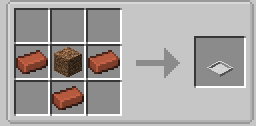
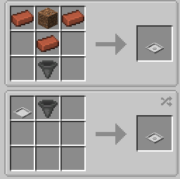

# Bonsai Crops

A Minecraft mod adding a block that grows crops inside a single block space.

This mod introduces two blocks: Bonsai Pot, Hopping Bonsai Pot.

Their craft recipes are as follows:

To use Bonsai Pot, simply hold a seed in your hand (either main-hand or
off-hand) and right-click Bonsai Pot. The seed will be put into the pot
and the plant will start growing. To get the seed back from the pot, make
sure your hand holds nothing and then right-click the pot.

When the seed is put into the pot, it will be growing, and after ten seconds
it will be mature. To harvest the crop, hold a hoe in your hand and
right-click the pot. The pot will drop items from this harvest and the crop
will grow again from scratch.

To automate the harvest behaviour, you can craft Hopping Bonsai Pot (the
recipe has been given above). With this type of pot, crops will be
automatically harvested whenever it becomes mature (artificial harvest is
still available though), and the drops will be put into the container below
the pot. So make sure you have one container (such as chests in Vanilla)
below Hopping Bonsai Pot and the container has enough space to receive the
drops, or the pot will not be able to carry out the automation and become
ceased when crops become mature.

The drop items come right from the definitions from loot tables of the crop
block. To modify drop items of the crop, simply modify the loot table of the
crop block through datapacks.